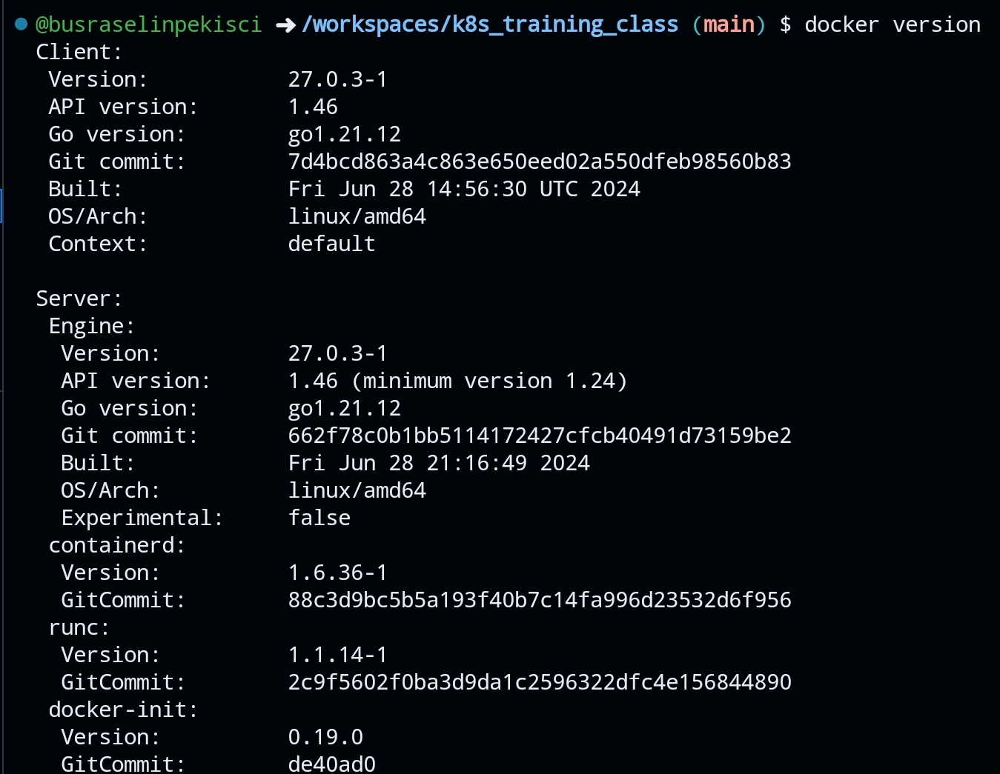

#Docker Version Check

Docker versiyonunu kontrol etmek için aşağıdaki komutu kullanabilirsiniz:

```bash
docker --version
```


Ya da daha ayrıntılı bilgi almak için:

```bash
docker version
```

Bu komutlar, yüklü olan Docker sürümünü ve diğer ilgili bilgileri gösterecektir.

