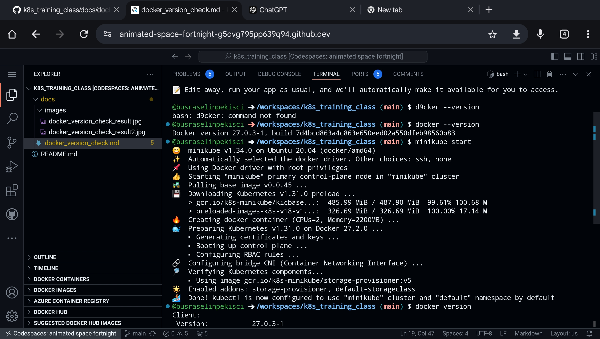
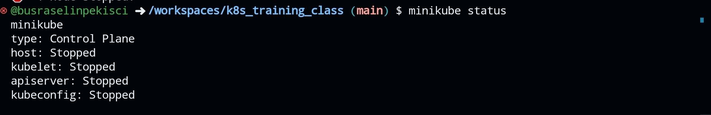

#Minikube Start

Minikube'u başlatmak için aşağıdaki adımları izleyebilirsiniz:

1. **Minikube'un Yüklü Olduğundan Emin Olun**: Minikube'un yüklü olduğundan emin olun. Terminalde aşağıdaki komutu çalıştırarak kontrol edebilirsiniz:

   ```bash
   minikube version
   ```

2. **Minikube'u Başlatın**: Aşağıdaki komutla Minikube'u başlatın:

   ```bash
   minikube start
   ```



   Bu komut, varsayılan bir Kubernetes kümesi oluşturacak ve çalıştıracaktır.

3. **Durumu Kontrol Edin**: Minikube'un başarılı bir şekilde başlatıldığını kontrol etmek için şu komutu kullanabilirsiniz:

   ```bash
   minikube status
   ```



4. **Kubernetes Dashboard'a Erişim**: Minikube başlatıldıktan sonra, Kubernetes Dashboard'u açmak için şu komutu kullanabilirsiniz:

   ```bash
   minikube dashboard
   ```

Bu adımlar, Minikube'u başlatmak için gereken temel işlemleri kapsar. Eğer belirli bir sürüm veya ayar gerekiyorsa, komutları buna göre özelleştirebilirsiniz.

## Steps to Install Minikube (Tuncer)

 

 1. **Update and Upgrade the System**:

    Before proceeding, it's good practice to update the package lists and upgrade installed packages:

       ```bash

          sudo apt update && sudo apt upgrade -y

             ```

              

              2. **Start Minikube with Docker Driver**:

                 To start Minikube using Docker as the driver, run the following command:

                    ```bash

                       minikube start --driver=docker

                          ```

                           

                           3. **Check Minikube Status**:

                              Verify that Minikube is running correctly:

                                 ```bash

                                    minikube status

                                       ```

                                        

                                        4. **Access the Minikube Dashboard (Optional)**:

                                           Minikube provides a dashboard for visual management. To launch it, run:

                                              ```bash

                                                 minikube dashboard

                                                    ```

                                                     

                                                     5. **Using kubectl with Minikube**:

                                                        You can now use `kubectl` to manage your Minikube cluster. For example, check the nodes in your cluster with:

                                                           ```bash

                                                              kubectl get nodes

                                                                 ```